# 💬 Discussion on Docs

A high-performance **Retrieval-Augmented Generation (RAG)** document discussion system built with **Next.js 16 (App Router)** and **React 19**. This platform enables users to upload PDF, DOCX, or TXT documents, processes them asynchronously using a robust **BullMQ + Redis** worker queue, indexes document segments into a local **ChromaDB Vector Store** using **LangChain** and **OpenAI Embeddings** (via OpenRouter), and allows users to have rich, context-aware conversations powered by **GPT-4o-mini**.

---

<div align="center">

[](https://nextjs.org/)
[](https://react.dev/)
[](https://www.typescriptlang.org/)
[](https://redis.io/)
[](https://bullmq.io/)
[](https://www.trychroma.com/)
[](https://tailwindcss.com/)

</div>

---

## 🚀 Key Features

*   **⚡ Asynchronous Queue-Based Ingestion:** Uses **BullMQ** and **Redis** to delegate heavy tasks (PDF parsing, text splitting, embedding creation, and vector database indexing) to background processes. This prevents server timeout issues and keeps the user interface interactive.
*   **📂 Real-Time Progress Polling:** Features a state-of-the-art glassmorphic Sidebar utilizing **RTK Query** with active polling. Users receive live state updates such as `Uploading...`, `Reading...`, `Chunking...`, `Storing vectors...`, and `Ready` straight from the Redis status cache.
*   **🧠 High-Accuracy Text Extraction & Chunking:** Parses PDF files via `pdf-parse` and chunks text using LangChain's `RecursiveCharacterTextSplitter` (with a custom overlap system) to optimize context retrieval windows.
*   **🔍 Semantic Vector Search:** Stores dense vector embeddings generated by OpenAI's `text-embedding-3-small` in a local **ChromaDB** instance, providing highly relevant context retrieval based on semantic distance.
*   **💬 Context-Aware Chatbot:** Merges retrieved document context with user queries to generate accurate responses from **GPT-4o-mini** via the **OpenRouter** API, fall-backing gracefully to standard chat assistant logic.
*   **🎨 Premium Glassmorphic UI:** Designed with Tailwind CSS v4, dynamic dark/light mode integration, glassmorphism, responsive sidebar controls, and elegant animations.

---

## 🏗️ System Architecture & Data Flow

Below is the conceptual flow of the ingestion pipeline and the RAG-based query system:

```mermaid
graph TD
    %% Ingestion Pipeline %%
    subgraph Ingestion_Pipeline ["1. Document Ingestion Pipeline"]
        A[User Uploads File] -->|POST /api/upload| B[Next.js API Handler]
        B -->|Initialize Record| C[(Redis Status Hash)]
        B -->|Write File| D[Local filesystem ./uploads]
        B -->|Enqueue Job| E[BullMQ upload_file Queue]
        E -->|Processes Job| F[Background Worker]
        F -->|Step 1: Parse PDF| G[pdf-parse Extraction]
        G -->|Step 2: Split Text| H[RecursiveCharacterTextSplitter]
        H -->|Step 3: Embed & Store| I[ChromaDB Vector Store]
        I -->|Mark Complete| J[(Update Status: 'Ready' in Redis)]
    end

    %% Retrieval Pipeline %%
    subgraph Retrieval_Pipeline ["2. Context-Aware Q&A Cycle"]
        K[User Query / Chat] -->|Search Similar Documents| L[Retrieval Tool]
        L -->|Vector Similarity Query| M[(ChromaDB Vector DB)]
        M -->|Return Context Chunks| N[Combine Context + Question]
        N -->|LangChain Prompt Template| O[GPT-4o-mini LLM via OpenRouter]
        O -->|Generate Answer| P[AI Response to User]
    end
```



---

## 🛠️ Complete Tech Stack

| Component | Technology | Role |
| :--- | :--- | :--- |
| **Frontend Core** | React 19.2.4 & Next.js 16.2.6 (App Router) | Single Page UI Architecture & API Routing |
| **State Management** | Redux Toolkit & RTK Query | Automated caching, REST mutations, and polling |
| **Styling & Assets** | Tailwind CSS v4 & Lucide React | Glassmorphic theme system & sleek micro-interactions |
| **Job Queue & Broker**| BullMQ & ioredis | Distributing ingestion tasks & scheduling worker threads |
| **Status Database** | Redis (Hash & Sorted Sets) | Sub-millisecond tracking of active documents & upload states |
| **Document Parser** | `pdf-parse` | Extracting raw text layouts from uploaded PDF files |
| **Vector Database** | ChromaDB (v3.4.3) | Storing and executing similarity searches on dense vectors |
| **AI Orchestration** | LangChain (`@langchain/core`, `community`, `openai`) | Standardizing prompt structures, LLM calls, and chunk retrievers |
| **LLM & Embeddings** | OpenRouter (`gpt-4o-mini` & `text-embedding-3-small`) | Powering semantic embeddings and synthesis of context-aware answers |

---

## 📁 Repository Directory Structure

```
📂 discussion-on-docs
├── 📂 public/                      # Static assets & public resources
├── 📂 uploads/                     # Local temporary storage for uploaded files (git-ignored)
├── 📂 src/
│   ├── 📂 _utils/
│   │   └── 📄 createQueue.ts       # Utility wrapper to instantiate BullMQ queues
│   ├── 📂 types/
│   │   └── 📄 queue.ts             # TypeScript interfaces for job queue payloads
│   ├── 📂 app/
│   │   ├── 📂 api/
│   │   │   └── 📂 upload/
│   │   │       ├── 📂 remove/
│   │   │       │   └── 📄 route.ts # API: Deletes file from local disk, Redis indices, & ChromaDB
│   │   │       └── 📄 route.ts     # API: Enqueues documents & registers them in Redis status
│   │   ├── 📄 globals.css          # Tailwind CSS v4 variables and custom styles
│   │   ├── 📄 layout.tsx           # Global HTML shell wrapping Redux & Theme providers
│   │   ├── 📄 page.tsx             # Home view integrating Sidebar & Chat area
│   │   └── 📄 providers.tsx        # Integrates redux provider, custom authentication, and themes
│   ├── 📂 providers/
│   │   └── 📄 useAuth.tsx          # React Auth Context for managing simulated user scopes
│   ├── 📂 components/
│   │   ├── 📄 ChatArea.tsx         # Document conversational interface & message stream
│   │   ├── 📄 ThemeToggle.tsx      # High-fidelity button to switch dark/light modes
│   │   └── 📄 Sidebar.tsx          # Drag-&-drop upload box & live status file log
│   ├── 📂 lib/
│   │   ├── 📂 config/
│   │   │   ├── 📄 queueConnection.ts # Connection details for Redis worker queues
│   │   │   ├── 📄 embeddings.ts      # OpenRouter embeddings client setup (text-embedding-3-small)
│   │   │   └── 📄 llm.ts             # OpenRouter ChatOpenAI client setup (gpt-4o-mini)
│   │   ├── 📂 pipeline/
│   │   │   └── 📄 upload.pipeline.ts # Sequencer coordinate for file-to-vector transitions
│   │   ├── 📂 tools/
│   │   │   ├── 📄 retrievalResponse.tools.ts # Search queries ChromaDB & processes LLM synthesis
│   │   │   └── 📄 uploads.tools.ts   # FS operations, pdf parsing, Recursive Text Splitters
│   │   ├── 📄 redis.ts             # Instantiates the standard ioredis client
│   │   ├── 📄 uploadsStatus.ts     # Redis database queries for tracking upload objects
│   │   ├── 📄 queue.ts             # Core instance of the BullMQ upload queue
│   │   └── 📄 store.ts             # Fast mock backend storage helper
│   ├── 📂 store/
│   │   ├── 📂 api/
│   │   │   ├── 📄 baseApi.ts       # Base endpoint configuration for RTK queries
│   │   │   └── 📄 uploadApi.ts     # CRUD actions & listeners for the uploads pipeline
│   │   ├── 📄 hooks.ts             # Typed selectors & dispatch hooks for Redux state
│   │   └── 📄 store.ts             # Main Redux store definition
├── 📄 package.json                 # Dependency manifests, metadata, & npm commands
└── 📄 tsconfig.json                # TypeScript global settings
```

---

## ⚙️ Getting Started & Local Setup

To run this application locally, you will need **Node.js (v18+)**, a running instance of **Redis**, and a running **ChromaDB** container/service.

### 1. Prerequisites

#### Start Redis
Ensure your Redis instance is running locally on port `6379`.
```bash
# macOS (using Homebrew)
brew services start redis

# Docker
docker run -d -p 6379:6379 redis:alpine
```

#### Start ChromaDB
Ensure ChromaDB is running locally on port `8000`.
```bash
docker run -d -p 8000:8000 chromadb/chroma
```

---

### 2. Environment Configurations

Create a `.env` file in the root directory and add your OpenRouter API credentials:

```env
# OpenRouter API Key for Embeddings and Chat Q&A
OPENROUTER_API_KEY=your_openrouter_api_key_here
```

---

### 3. Installation

Clone the repository and install all dependencies:

```bash
npm install
```

---

### 4. Running the Project

Because the document parsing is fully asynchronous, you must run **both** the Next.js development server and the BullMQ background worker simultaneously.

#### Terminal 1: Run the Next.js Web Application
```bash
npm run dev
```

#### Terminal 2: Run the Background Queue Worker
```bash
npm run worker
```

Open [http://localhost:3000](http://localhost:3000) in your browser to view the application.

---

## 🧬 Understanding the RAG Pipeline

Here is a breakdown of what happens when you upload a document:

1.  **Ingestion (`POST /api/upload`):** The file is received by Next.js, initialized as a pending record in Redis with a status of `Uploading...`, saved locally to `./uploads`, and then pushed into the BullMQ queue (`upload_file`).
2.  **PDF Parsing (`uploads.tools.ts`):** The background worker pops the job and updates the status to `Reading...`. It uses `pdf-parse` to read the document and extract raw string buffers.
3.  **Recursive Chunking (`uploads.tools.ts`):** The worker updates the status to `Chunking...`. It runs the LangChain `RecursiveCharacterTextSplitter` to generate document chunks of size `500` characters with `50` characters overlap.
4.  **Vector Embedding & Storage (`uploads.tools.ts`):** The worker updates the status to `Storing vectors...`. It converts text chunks into vector embeddings using the `text-embedding-3-small` model and stores them inside the local **ChromaDB** instance under the file ID collection.
5.  **Completion (`upload.pipeline.ts`):** The worker marks the status as `Ready` in Redis, enabling the user to start chatting with the file.

---

## 💬 Query & Conversational Retrieval

When you ask a question about your document in the **Chat Area**:
1.  **Semantic Search (`retrievalResponse.tools.ts`):** The system queries the local ChromaDB database with the user's question, searching for the top 3 (`k: 3`) most similar text chunks.
2.  **Prompt Engineering:** The extracted text chunks are combined into a prompt layout acting as ground-truth context.
3.  **LLM Synthesizing:** The prompt is sent to `gpt-4o-mini` (via OpenRouter), which returns a highly accurate, citation-backed answer to the user.

---

## 📄 License & Terms

This project is open-source and available under the [MIT License](LICENSE).

<div align="center">
  <sub>Developed with ❤️ by SharmaG-Dev</sub>
</div>
